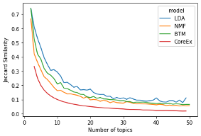

# Topic-Modeling-Comparative-Analysis

A compartive analysis between four topic modeling modeling methods:
- Latent Dirichlet Allocation (LDA)
- Non-negative Matrix Factorization (NMF)
- Biterm Topic Modeling (BTM)
- CoreEx

The models were evaluated using several metrics, including Perplexity, Coherence and Jaccard Distance. The results of the models for Jaccard Distance is shown below:

This work was done as a part of the course: INF2209 - Human Centred Topic Models.
